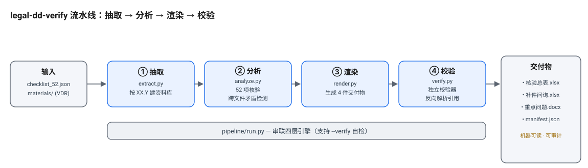

# legal-dd-verify · 尽职调查资料核验与补件反馈流水线




一个**数据驱动**的法律尽职调查资料核验流水线：读取一份 52 项尽职调查清单与一个虚拟资料室（VDR），逐项核验资料提供情况、识别跨文件矛盾、生成补件问询与重点问题，并输出 4 件机器可读的标准化交付物。

> 本仓库是**一个完整、可运行的工作示例（reference implementation）**：它绑定了一份我**从零原创**的虚构演示数据室（"云栖智联科技股份有限公司"）与一份通用核查清单。全部主体、人员、合同、账号、地址与交易数据均为合成信息，与任何真实主体、真实项目或第三方题库无关。

---

## 一、它解决什么问题

尽职调查里最容易被低估的工作量，是把目标公司扔过来的一大堆 PDF/XLSX/DOCX 资料，和一份长长的核查清单，逐条对上：

- 这份资料**提供了没有**？提供到什么程度（已满足 / 部分满足 / 未满足）？
- 不同文件之间**说法是否打架**？（章程写持股 10%、台账写 8%；隐私政策说无数据出境、云账单却显示新加坡节点含个人信息）
- 哪些**索赔/争议被漏列**进争议清单？
- 还**缺哪些资料**、需要向对方发补件问询？

`legal-dd-verify` 把这些动作固化成一条可复现的流水线，让律师把精力放在"判断与谈判"上，而不是"翻文件和填表"上。

---

## 二、核心设计原则

| 原则 | 说明 |
| --- | --- |
| **数据驱动，不写死答案** | 目标公司名称、关联方、境外区域、年份、关键人、股权比例等**全部在运行期从资料中抽取**，代码里不内置任何实例级"答案"。唯一常量是 `pipeline/profile.py` 中的**交易框架**（买方、受让比例、基准日），属于方案设计参数，与具体哪家公司无关。 |
| **离线 / 零依赖安装** | 依赖（pypdf、openpyxl、et_xmlfile）已随包 **vendored** 于 `vendor/`；`.docx` 解析用自研纯标准库 `_docx.py` 替代 `python-docx`（规避其 `lxml` C 扩展无法跨平台 vendored 的问题）。运行期不需要 `pip install`、不需要联网。 |
| **独立校验器** | `pipeline/verify.py`（亦经 `evaluation/verify.py` 调用）不依赖分析引擎，只读取 4 件交付物 + 原始资料，校验：引用是否都能解析到真实源文件、52 项是否唯一且枚举合法、4 类核心风险是否覆盖、跨文件矛盾是否记录并挂接、补件问询是否去重且类型合法、重点问题摘要是否含规定章节与 8–12 个重点问题。 |
| **跨文件矛盾检测** | 结构化比对文件实质内容（比例、金额、表述、部署区域），而非仅看文件名，识别出股权多源比例不一致、数据跨境表述与部署不一致、重大索赔漏列等矛盾。 |
| **4 件标准化交付物** | 核验总表（xlsx）、补件问询清单（xlsx）、重点问题摘要（docx）、机器可读清单 `result_manifest.json`。 |

---

## 三、交付物

运行后输出到 `--out` 目录：

| 文件 | 内容 |
| --- | --- |
| `尽调清单核验与反馈表.xlsx` | 52 项逐条核验：状态 / 事实摘要 / **证据定位（精确到文件）** / 资料缺口 / 风险等级 / 处置类型 / 是否需人工复核；含"证据索引""跨文件矛盾""统计摘要"三张附表。 |
| `补充资料及问询清单.xlsx` | 把重复缺件合并为约 20 条可执行补件/问询（P0/P1/P2 分级、责任方、建议时点），并给出"对应关系"表。 |
| `重点问题摘要.docx` | 交易及审阅范围、执行摘要、跨文件矛盾识别、核验状态统计、12 项重点问题、优先补件与下一步、范围限制与人工复核提示。 |
| `result_manifest.json` | 机器可读清单：52 项（含证据列表）、重点问题、跨文件矛盾，供下游系统直接消费。 |

绑定演示数据室运行的结果（`examples/`）已通过独立校验器：**52 项唯一且枚举合法、4 类核心风险全部覆盖、识别 3 处跨文件矛盾、0 处引用无法解析 → PASS**。

---

## 四、演示数据室（完全原创、合成）

`materials/` 下是一份我**独立撰写**的虚构数据室，主体为"云栖智联科技股份有限公司"（CEO 林远、CTO 沈澈、投资人华晟创业投资有限公司等），覆盖主体资格、股权与治理、重大合同与融资、知识产权与 IT、劳动人事、数据合规与业务资质、争议债务与保险、物业 8 大领域共 29 份资料。

数据室刻意埋设了若干典型瑕疵，用于演示流水线的识别能力，例如：

- **股权多源比例不一致**：员工持股平台在内部台账记 8%，在章程（第 18 条）与组织架构记 10%；
- **数据跨境表述与部署不一致**：隐私政策称无客户生产数据出境、海外仅演示数据，但云账单显示新加坡节点承载含个人信息的日志与账号标识符；
- **重大索赔漏列**：供应商丙逾期付款律师函未列入诉讼仲裁及或有负债清单；
- **许可过期**：增值电信业务经营许可证已过有效期仍经营 SaaS；
- **CTO 劳动合同未签署**：核心人员沈澈的劳动合同及 IP 协议为未签署稿。

> 以上均为演示用虚构设定，不映射任何真实事件。

---

## 五、快速开始

环境：Python ≥ 3.8（依赖已 vendored，无需联网安装）。

```bash
# 1) 进入流水线目录
cd pipeline

# 2) 用绑定的原创演示数据室跑通整条链路，并运行独立校验器
python3 run.py --out ../examples --verify
```

可选：指向你自己的资料室与清单（清单支持 JSON 或 XLSX）：

```bash
python3 run.py \
  --input   /path/to/your/materials \
  --checklist /path/to/your/checklist_52.json \
  --out     /path/to/output \
  --verify
```

---

## 六、目录结构

```
legal-dd-verify/
├── pipeline/            # 引擎（extract → analyze → render → verify → run）
│   ├── extract.py      # 资料抽取（PDF/XLSX/DOCX + 离线 .txt 视图），按 XX.Y 文档前缀建索引
│   ├── analyze.py      # 52 项核验 + 跨文件矛盾检测（实例无关）
│   ├── render.py       # 渲染 4 件交付物
│   ├── verify.py       # 独立一致性校验器（不依赖分析引擎）
│   ├── profile.py      # 交易框架常量（买方 / 受让比例 / 基准日）
│   └── run.py          # 一键编排 + 可选 --verify
├── materials/          # 绑定的原创合成演示数据室（29 份 .txt 抽取视图）
├── checklist/          # 52 项通用核查清单 checklist_52.json
├── examples/           # 绑定演示数据室的运行结果（已通过校验）
├── evaluation/         # 独立校验器入口与说明
├── vendor/             # 离线 vendored 依赖（pypdf / openpyxl / et_xmlfile）
├── _docx.py            # 纯标准库 .docx 读写（替代 python-docx）
├── agents/             # 主代理说明（如何调用流水线）
└── LICENSE             # MIT
```

---

## 七、用途边界与诚实声明

- **这是支持性分析工具，不是正式法律意见**，不替代对登记机关、主管机关及合同相对方的独立核验，也不替代律师的专业判断。
- **绑定演示数据室为完全虚构的合成信息**，由本仓库作者原创撰写，未使用任何第三方题库、真实项目或竞赛素材；运行结果中的"范围限制"章节亦已注明。
- **引擎绑定演示数据室的文档结构**：事实抽取层（`extract.build_facts`）针对该演示数据室的表名/字段与矛盾模式编写。若用于文档结构不同的真实项目，需要相应扩展事实抽取与矛盾检测规则——这不是一个"开箱即用、零改造"的通用尽调产品，而是一个可复现的方法论示例。
- 未见证据的事项在交付物中写为"资料缺口 / 待提供"，**不会**把"未提供"表述为"违法"或"无效"。

---

## 八、许可证

[MIT](LICENSE)。可自由用于学习与研究；如用于商业或二次分发，请保留作者与许可证声明，并知悉上述用途边界。
